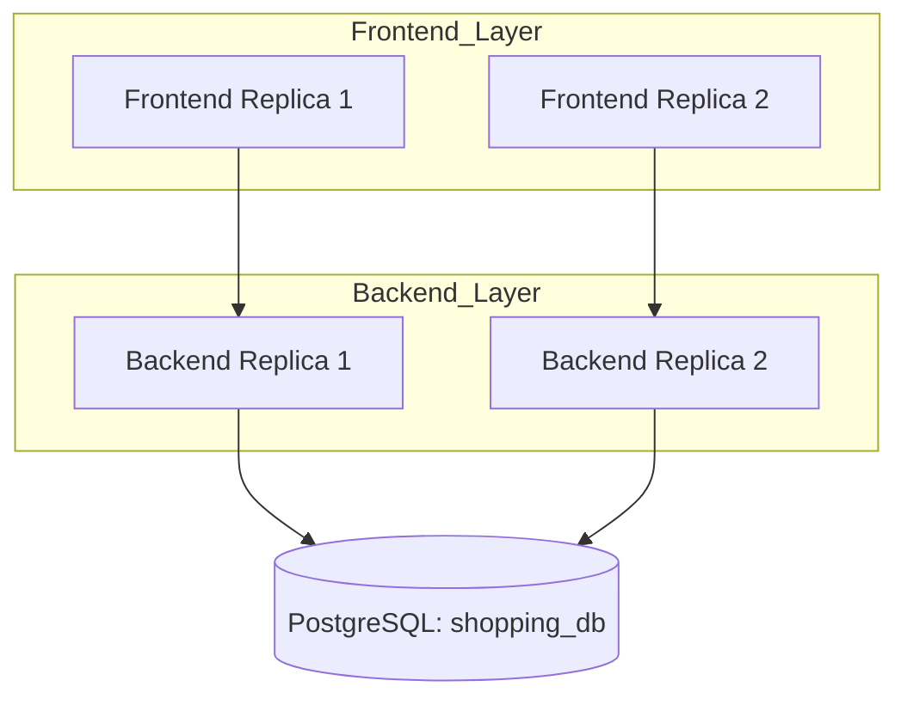
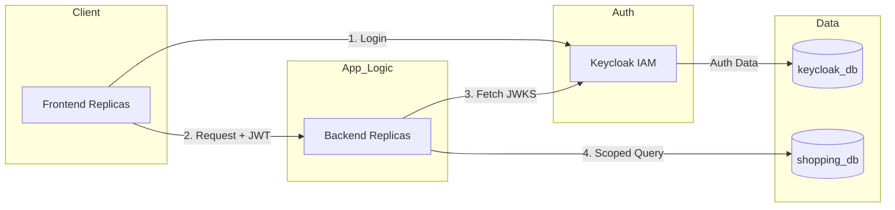

# K3s CICD Play 🚀

A comprehensive playground for exploring full-stack systems architecture, container orchestration, and Identity and Access Management (IAM). This project demonstrates the evolution of a production-grade application from local development to a fully orchestrated K3s environment.
> [!NOTE]
> For step-by-step instructions and my original project log, please refer to the [readme.txt](./readme.txt) file in the root directory.

## 🏗 Project Phases

### Phase 1: Core Systems Foundation
A baseline "Software Artist" implementation of a Shopping List application.
* **Components:** React (Vite) Frontend, Fastify (TypeScript) Backend, PostgreSQL.
* **Architecture:** Demonstrates horizontal scaling with 2 backend replicas and 2 frontend replicas.
* **Database:** A single `shopping_db` instance.

### Phase 2: IAM Integration (Enterprise Security)
Integration of Keycloak as a commodity IAM solution to handle authentication without reinventing the wheel.
* **Security**: JWT verification using RS256 asymmetric keys.
* **Persistence**: Multi-database setup within Postgres (shopping_db and keycloak_db).
* **Auth Flow**: Frontend performs OIDC login; Backend validates tokens via JWKS.

## 🚦 Three Modes of Operation
### Mode A: Hybrid Development
**Best for**: Rapid iterative coding of the application logic.
* **Start infrastructure**: `docker compose up -d db keycloak`
* **Backend**: `cd backend && npm install && npm run dev`
* **Frontend**: `cd frontend && npm install && npm run dev`

### Mode B: Fully Containerized (Docker)
**Best for**: Testing container networking and environment parity.
* **Run**: `docker compose up -d --build`
* **Access at**: `http://localhost:3001`

### Mode C: Full Orchestration (K3s)
**Best for**: Simulating production-like CI/CD and orchestration.
* **Run**: `kubectl apply -k .`
* **Note**: Backend service is exposed via NodePort `30000` for diagnostics.
* **Access Frontend at**: `http://localhost:30001`

## 🛠 Tech Stack
* **Frontend**: React, Vite, Tailwind CSS
* **Backend**: Fastify, TypeScript, `@fastify/jwt`
* **Database**: PostgreSQL 16
* **IAM**: Keycloak 24
* **Orchestration**: K3s, Docker, Kubernetes Manifests (Kustomize)

## 📝 Architectural Highlights
* **JWKS Integration**: The backend dynamically fetches public keys from Keycloak to verify tokens, ensuring zero-trust communication.
* **High Availability**: Ready for replica scaling in K3s deployment manifests.
* **TDD Ready**: Includes a "Software Artist" secret door for local testing using `x-test-auth` headers to bypass live IAM during development.
